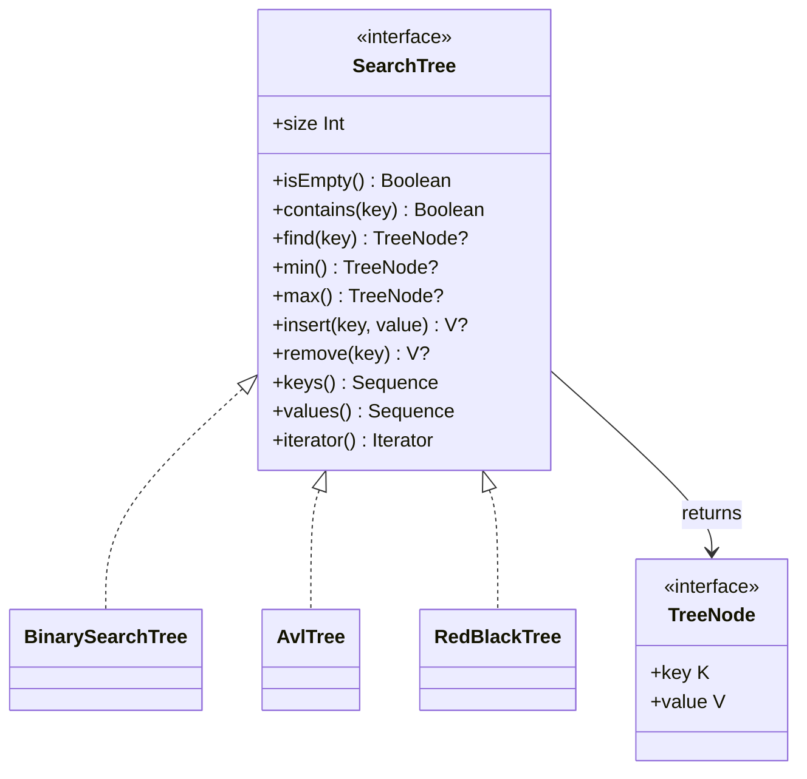
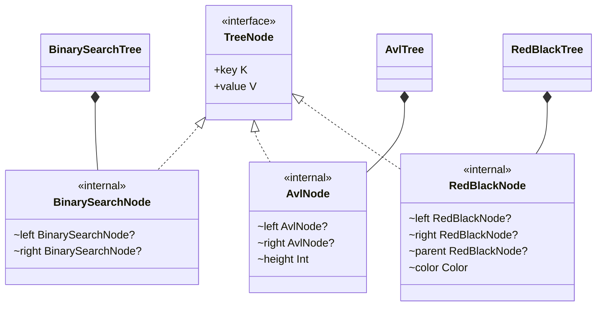

# Search Trees Library Architecture

## 1. Scope

The library provides three binary search tree implementations with one common public contract:

- `BinarySearchTree`;
- `AvlTree`;
- `RedBlackTree`.

This document describes the first project stage only. It defines types, visibility, method signatures, behavior, and
relationships, but does not define the algorithms used during insertion, deletion, or balancing.

## 2. Package layout

```text
src/main/kotlin/io/vloikov/searchtrees/
├── SearchTree.kt
├── TreeNode.kt
├── bst/
│   ├── BinarySearchTree.kt
│   └── BinarySearchNode.kt
├── avl/
│   ├── AvlTree.kt
│   └── AvlNode.kt
└── redblack/
    ├── RedBlackTree.kt
    └── RedBlackNode.kt
```


## 3. Class model



The three concrete trees implement the same interface directly. They do not inherit from each other because every tree
must preserve different structural invariants during mutation.

The internal node relationships are:



## 4. Public API

### `TreeNode`

```kotlin
public interface TreeNode<out K, out V> {
    public val key: K
    public val value: V
}
```

`TreeNode` is a read-only view returned to library users. Child links, parent links, AVL height, and red-black color are
implementation details and are not exposed through this interface.

### `SearchTree`

```kotlin
public interface SearchTree<K : Comparable<K>, V> :
    Iterable<TreeNode<K, V>> {

    public val size: Int

    public fun isEmpty(): Boolean

    public operator fun contains(key: K): Boolean

    public fun find(key: K): TreeNode<K, V>?

    public fun min(): TreeNode<K, V>?

    public fun max(): TreeNode<K, V>?

    public fun insert(key: K, value: V): V?

    public fun remove(key: K): V?

    public fun keys(): Sequence<K>

    public fun values(): Sequence<V>

    override fun iterator(): Iterator<TreeNode<K, V>>
}
```

### Concrete tree types

```kotlin
public class BinarySearchTree<K : Comparable<K>, V> : SearchTree<K, V>

public class AvlTree<K : Comparable<K>, V> : SearchTree<K, V>

public class RedBlackTree<K : Comparable<K>, V> : SearchTree<K, V>
```

Each concrete class overrides every member of `SearchTree` with the same signature. The source skeletons are deliberately
compilable but throw `NotImplementedError` through `TODO` until the implementation stage.

## 5. Operation semantics

### Key ordering and uniqueness

Keys are ordered using `Comparable.compareTo`. Two keys represent the same tree position when their comparison returns
zero, even if their `equals` implementations produce a different result. Each tree contains at most one node for a given
position in that ordering.

### Search

`find(key)` returns a read-only node containing the matching key and value, or `null` when the key is absent.

`contains(key)` returns whether a matching node exists and enables Kotlin membership syntax:

```kotlin
if (key in tree) {
    // The key exists.
}
```

### Insertion

`insert(key, value)` behaves as follows:

- for a new key, it inserts a node, increments `size`, and returns `null`;
- for an existing key, it replaces the stored value, leaves `size` unchanged, and returns the previous value.

### Removal

`remove(key)` behaves as follows:

- for an existing key, it removes the node, decrements `size`, and returns the removed value;
- for an absent key, it leaves the tree unchanged and returns `null`.

As with Kotlin map operations, a nullable `V` makes a `null` result ambiguous: it may mean that no value existed or that
the previous or removed value was itself `null`. Callers that need to distinguish those cases can use `contains` before
the mutation.

### Minimum and maximum

`min()` and `max()` compare keys rather than values. They return the node with the minimum or maximum key, respectively,
or `null` when the tree is empty.

### Size and emptiness

`size` is the number of nodes currently stored in the tree. `isEmpty()` returns whether `size` is zero.

### Iteration

The standard iterator performs an in-order traversal:

```text
left subtree -> node -> right subtree
```

It therefore yields nodes in ascending key order. `keys()` and `values()` use the same order. Mutating a tree while one of
its iterators or sequences is being consumed is unsupported. The first implementation does not provide a fail-fast
concurrent-modification mechanism.

## 6. Internal node model

All concrete node types are `internal`. Library users interact with them only through the public read-only `TreeNode`
interface.

### Binary search node

```kotlin
internal class BinarySearchNode<K : Comparable<K>, V>(
    override val key: K,
    override var value: V,
) : TreeNode<K, V> {
    internal var left: BinarySearchNode<K, V>? = null
    internal var right: BinarySearchNode<K, V>? = null
}
```

### AVL node

```kotlin
internal class AvlNode<K : Comparable<K>, V>(
    override val key: K,
    override var value: V,
) : TreeNode<K, V> {
    internal var left: AvlNode<K, V>? = null
    internal var right: AvlNode<K, V>? = null
    internal var height: Int = 1
}
```

AVL nodes do not store parent links. Recursive mutations can return the new root of each changed subtree while height is
updated during unwinding.

### Red-black node

```kotlin
internal class RedBlackNode<K : Comparable<K>, V>(
    override val key: K,
    override var value: V,
) : TreeNode<K, V> {
    internal var left: RedBlackNode<K, V>? = null
    internal var right: RedBlackNode<K, V>? = null
    internal var parent: RedBlackNode<K, V>? = null
    internal var color: Color = Color.RED

    internal enum class Color {
        RED,
        BLACK,
    }
}
```

Only red-black nodes store a parent link because restoration after insertion and removal repeatedly navigates between a
node, its parent, grandparent, and uncle. Color is a nested enum so only the two valid named states can be assigned.
Conceptual NIL children are represented by `null` and treated as black by the balancing algorithm.

## 7. Encapsulation

Structural fields are deliberately absent from the public API. Exposing mutable links would allow callers to violate tree
ordering, balancing properties, parent-child consistency, and `size`. Even read-only links would make the physical shape
and lifetime of internal nodes part of the compatibility contract.

The architecture document still describes all internal fields required by the implementations. Tests compiled as part of
the project may inspect internal node state when direct invariant verification is necessary.

## 8. Expected complexity

Let `h` be the current height of a tree and `n` its number of nodes.

| Operation | Expected time |
|---|---:|
| `find`, `contains`, `insert`, `remove` | `O(h)` |
| `min`, `max` | `O(h)` |
| `size`, `isEmpty` | `O(1)` |
| complete iteration | `O(n)` |

AVL and red-black trees maintain `h = O(log n)`. An ordinary binary search tree may degrade to `h = O(n)` for an
unfavorable insertion order.

## 9. Non-goals of the first implementation

The initial library contract does not include:

- custom comparators;
- duplicate nodes with equivalent keys;
- selectable traversal orders;
- mutable access to nodes;
- serialization or visualization;
- thread-safety;
- fail-fast iterators.
